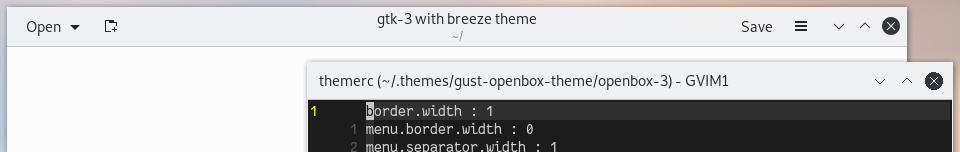

# Breeze Openbox Theme

Not a direct copy of the KDE window decorations, but designed to look
reasonable when used with the Breeze QT or GTK themes. 

This is a fork. It includes minor changes to the original [theme](https://github.com/mostlyoxygen/gust-openbox-theme) made by [mostlyoxygen](https://github.com/mostlyoxygen).

To install the theme, run:

```
git clone https://github.com/asdhio-github/breeze-openbox-theme/
mv breeze-openbox-theme ~/.themes/
```


